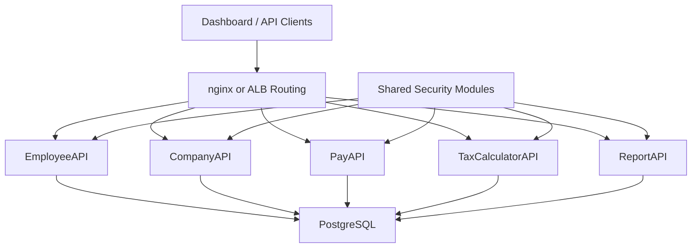

# Project Structure

## Overview

DemoSkills is organized as a multi-service practice repo with shared security code, local Docker orchestration, AWS deployment assets, and a small dashboard UI.



## Top-Level Layout

```text
DemoSkills/
  README.md
  TECH_STACK.md
  STRUCTURE.md
  GOALS.md
  docker-compose.yml

  apis/            # Backend APIs
  dashboard/       # Simple UI/static frontend
  lambdas/         # Serverless experiments
  Shared/          # Shared cross-service code and docs
  docker/          # nginx and container support files
  .harness/        # Harness pipeline config
  scripts/         # Utility scripts
  commands/        # Local command helpers
  docs/archive/    # Older planning and experiment notes
```

## API Projects

- `apis/EmployeeAPI` is the main .NET API and currently contains the most complete auth, migration, and testing flow.
- `apis/CompanyAPI` is a Python/FastAPI service.
- `apis/PayAPI` is a .NET API for payroll-oriented workflows.
- `apis/TaxCalculatorAPI` is a .NET API for tax-related logic.
- `apis/ReportAPI` is a Python/FastAPI service for reporting scenarios.
- `apis/aws.http` contains local/request testing helpers.

## Shared Code

- `Shared/Security/dotnet/Shared.Security.Net` contains shared .NET auth and authorization components.
- `Shared/Security/py/shared_security_py` contains shared Python auth helpers.
- `Shared/Security/AuthRoleMatrix.txt` is the working auth role/permission reference.
- `Shared/Security/SecuritySpec.md` captures the higher-level security design.

## UI and Local Runtime

- `dashboard/` contains the lightweight frontend used for local and demo flows.
- `docker-compose.yml` starts nginx, the dashboard, PostgreSQL, and the API containers together.
- `docker/nginx/` contains the local routing configuration used to mirror the multi-service setup.

## Infrastructure and Delivery

- `.harness/` stores CI/CD pipeline configuration.
- `docker/` stores supporting container and routing assets.
- `lambdas/` contains serverless practice projects such as `TimeClockLambda` and `VacationLambda`.

## Common Patterns

- .NET APIs use ASP.NET Core, Swagger, Serilog, and FluentMigrator.
- Python APIs use FastAPI and shared Python security helpers.
- Auth uses JWT validation plus database-backed authorization concepts.
- PostgreSQL is shared across services for local and hosted practice environments.
- Tests live near the owning project, with `EmployeeAPI` currently having the strongest unit-test coverage structure.
