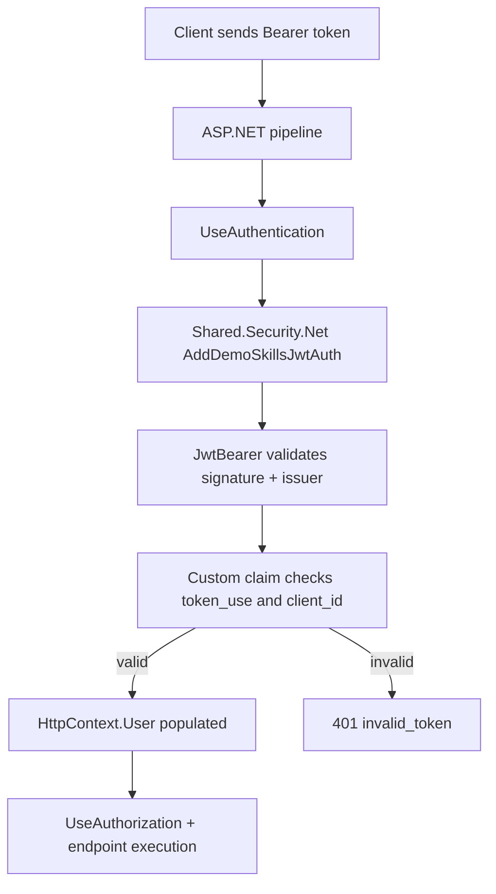
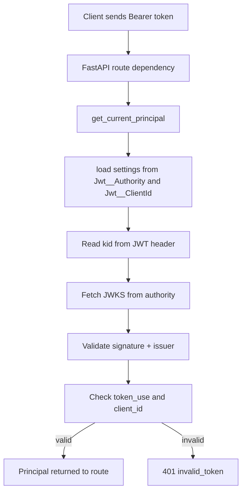

# DemoSkills Security Spec

This document defines the shared JWT authentication model for both .NET and Python APIs.

## Common Contract

- Token type for API access: `access_token`
- Authority/issuer config key: `Jwt__Authority`
- Client id config key: `Jwt__ClientId`
- Required claim checks:
  - `token_use == "access"`
  - `client_id == Jwt__ClientId`
- Signature algorithm: `RS256`
- JWKS endpoint: `{Jwt__Authority}/.well-known/jwks.json`

## .NET JWT Flow

## Python JWT Flow

## Operational Notes

- Health endpoints can remain anonymous while business endpoints require auth.
- Swagger/OpenAPI should use Bearer auth in every API.
- Same Cognito token is accepted by all APIs when `Jwt__Authority` and `Jwt__ClientId` match.
- If using shared code in Docker builds, use repo root build context so shared folders are available.
