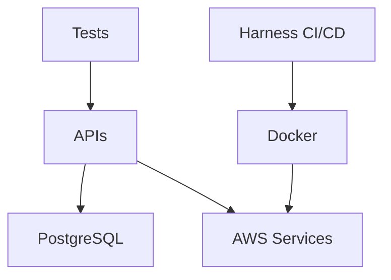

# Tech Stack

## Core Technologies
### Backend
- Language: C# (.NET 8)
  - Framework: ASP.NET Core Web API
  - Target Framework: net8.0
  - Key Packages:
    - Microsoft.AspNetCore.Authentication.JwtBearer
    - Serilog
    - Swashbuckle.AspNetCore

- Language: Python 3.12
  - Framework: FastAPI
  - Key Packages:
    - fastapi
    - uvicorn
    - pytest

### Frontend
- Dashboard: static HTML/CSS/JS served by nginx

### Database
- PostgreSQL (shared across APIs)
  - ORM: Entity Framework Core (planned) / SQLAlchemy (planned)
  - Migration Tools: EF Core Migrations / Alembic (planned)

### Infrastructure
- Docker
  - Base Images:
    - mcr.microsoft.com/dotnet/aspnet:8.0
    - python:3.12-slim
    - nginx:1.27-alpine (dashboard)
  - Multi-stage builds for optimization

- AWS Services
  - ALB: Ingress and routing (host-based today)
  - ECS (Fargate): Container orchestration
  - ECR: Image registry
  - RDS: Managed PostgreSQL
  - Lambda: Serverless functions (optional)

## Development Tools
### IDE and Version Control
- VS Code
  - Required Extensions:
    - C# Dev Kit
    - Python
    - Docker
    - GitLens
  - Recommended Settings in .vscode/

- Git + GitHub
  - Branch Strategy: feature branches (feature/xxx) merged via PR
  - PR Requirements: Tests + Review

### Testing
- Unit Testing
  - C#: xUnit
  - Python: pytest
  - Coverage: 80% minimum (goal)

- BDD Testing
  - C#: SpecFlow (planned)
  - Python: pytest-bdd (planned)
  - Gherkin specs in /tests/features/ (planned)

### CI/CD (Harness)
- Pipeline Types:
  - Build + Test
  - Deploy to AWS
  - Infrastructure as Code
  - Automated Teardown

## AI Integration
### GitHub Copilot
- Use Cases:
  - Code completion
  - Unit test generation
  - Documentation assistance
  - API endpoint suggestions

### ChatGPT (GPT-5)
- Use Cases:
  - Architecture planning
  - Code review assistance
  - Documentation generation
  - Problem-solving

## Dependencies Graph

## Configuration Management
- AWS credentials via AWS CLI/profile or Harness secrets
- Database connection strings in secrets
- Environment-specific settings:
  - `.NET`: `appsettings.Development.json`
  - Python: `.env` (+ `.env.example`)
- CI/CD variables in Harness
