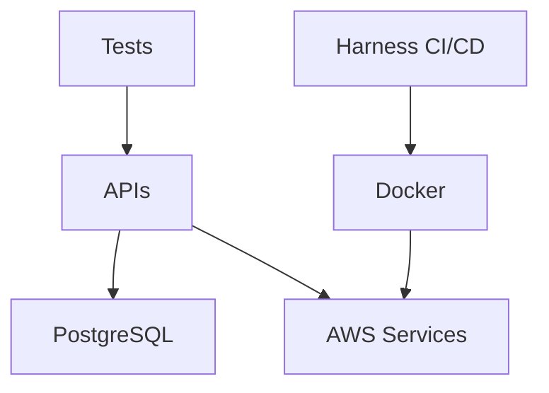

# Tech Stack

## Core Technologies
### Backend
- Language: C# (.NET 8)
  - Framework: ASP.NET Core Web API
  - Target Framework: net8.0
  - Key Packages:
    - Microsoft.AspNetCore.Authentication.JwtBearer
    - Serilog
    - Swashbuckle.AspNetCore

- Language: Python 3.x
  - Framework: FastAPI
  - Key Packages:
    - fastapi
    - uvicorn
    - python-jose[cryptography]
    - pytest

### Database
- PostgreSQL
  - ORM: Entity Framework Core / SQLAlchemy
  - Migration Tools: EF Core Migrations / Alembic

### Infrastructure
- Docker
  - Base Images:
    - mcr.microsoft.com/dotnet/aspnet:8.0
    - python:3.11-slim
  - Multi-stage builds for optimization

- AWS Services
  - Lambda: Serverless functions
  - ECS: Container orchestration
  - API Gateway: API management
  - RDS: Managed PostgreSQL

## Development Tools
### IDE and Version Control
- VS Code
  - Required Extensions:
    - C# Dev Kit
    - Python
    - Docker
    - GitLens
  - Recommended Settings in .vscode/

- Git + GitHub
  - Branch Strategy: trunk-based
  - PR Requirements: Tests + Review

### Testing
- Unit Testing
  - C#: xUnit
  - Python: pytest
  - Coverage: 80% minimum

- BDD Testing
  - C#: SpecFlow
  - Python: pytest-bdd
  - Gherkin specs in /tests/features/

### CI/CD (Harness)
- Pipeline Types:
  - Build + Test
  - Deploy to AWS
  - Infrastructure as Code
  - Automated Teardown

## AI Integration
### GitHub Copilot
- Use Cases:
  - Code completion
  - Unit test generation
  - Documentation assistance
  - API endpoint suggestions

### ChatGPT (GPT-5)
- Use Cases:
  - Architecture planning
  - Code review assistance
  - Documentation generation
  - Problem-solving

## Dependencies Graph

## Configuration Management
- AWS credentials via AWS CLI
- Database connection strings in secrets
- Environment-specific settings in appsettings.json / .env
- CI/CD variables in Harness
